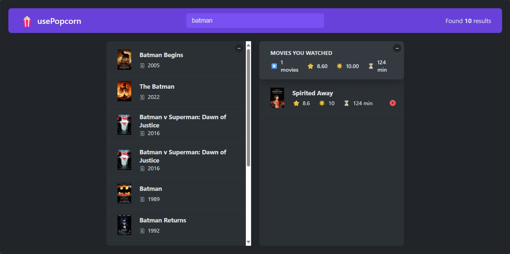

# usePopcorn

A mini-project in Jonas Schmedtmann's Ultimate React Course. A simple app where users can search for movies, rate them, and add them to their watched list. Built with React.

Live Demo [here](https://usepopcorn-jmgf.netlify.app/).

## Technologies Used

- Build tool - Create React App
- Styling - CSS

## Features

- Search for movies via an API, rate them, and add them to your watched list
- Display average statistics of all movies in your watched list

## Screenshots

